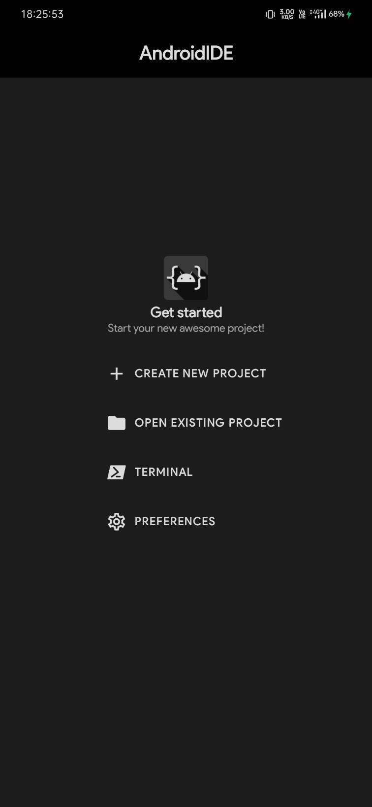
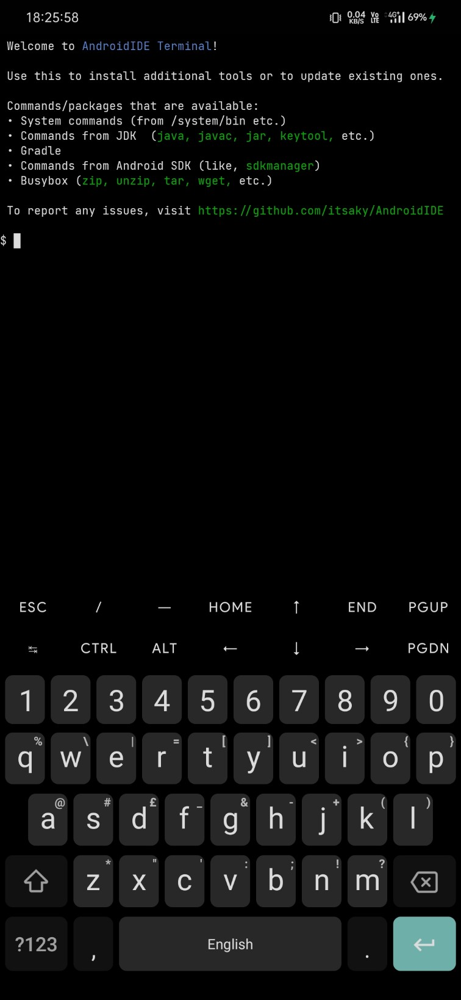
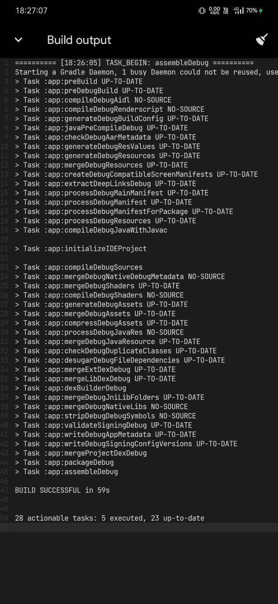
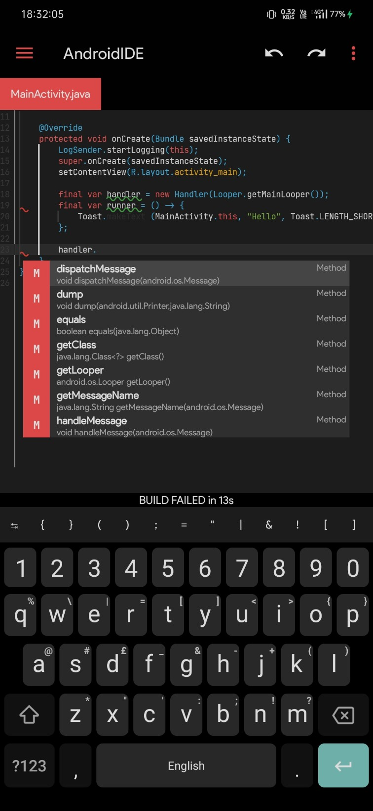
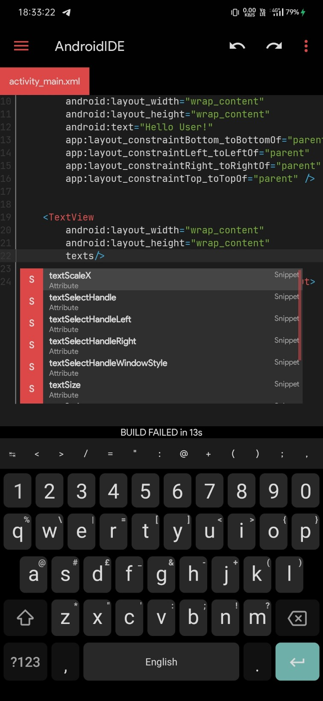
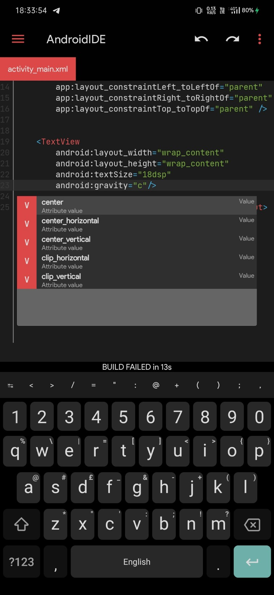
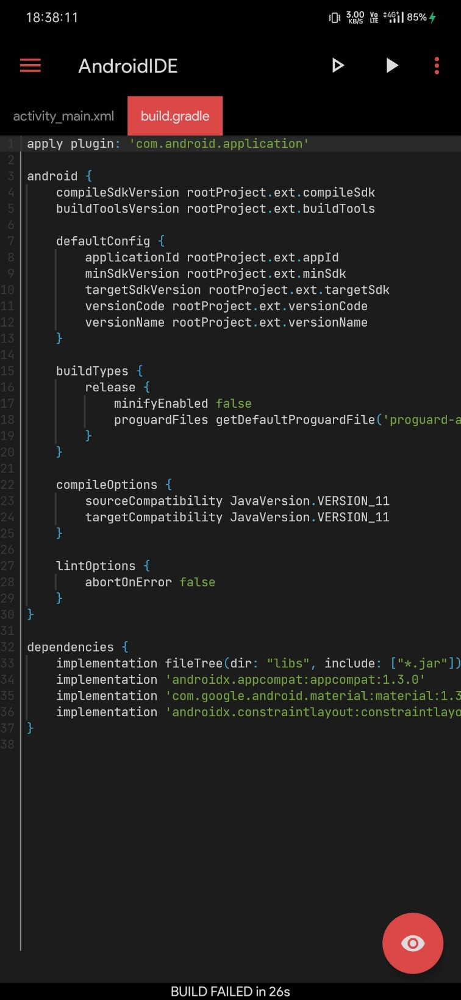
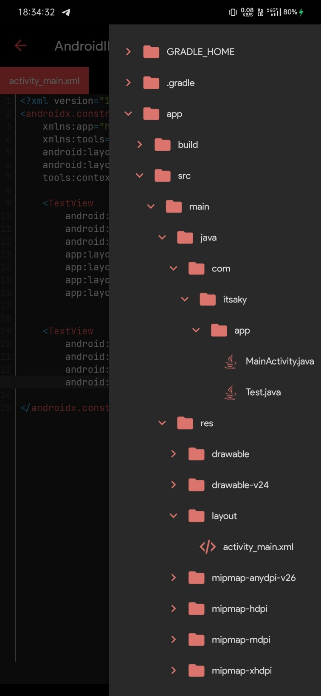

<p align="center">
  
  <h1 align="center"><b>AndroidIDE</b></h1>
</p>
<p align="center">
  
  
  <a href="./LICENSE"></a>
  <br>
  <a href="https://t.me/androidide_discussions"></a>
</p><br>

## Main Features
- Supports Gradle
- Comes with OpenJDK 11.0.12
- Provides auto completion for Java and XML. It also has basic (reserved) completion for Gradle files.

More features will be implemented as we continue to develop this app.

## Features to be implemented
- [x] Advanced Java Auto Complete
- [x] Terminal
- [x] Custom environment variables (for Build & Terminal)
- [x] SDK Manager (Available via terminal)
- [x] Gradlew support (with some limitations)
- [x] API information for classes and their members (since, removed, deprecated).
- [ ] Implement language servers
  - [ ] XML
  - [ ] Kotlin
- [ ] UI Designer
  - [x] Layout inflater
  - [x] Resolve resource references
  - [ ] Auto-complete resource values when user edits attributes using the attribute editor
  - [ ] Drag & Drop (*)
  - [ ] Visual attribute editor (*)
  - [ ] Android Widgets (*)
- [ ] String Translator
- [ ] Asset Studio (Drawable & Icon Maker)
- [ ] Git (*)

Items marked with `(*)` are partially implemented.
Git is currently available only in the terminal i.e. no GUI interface for `git`.

## Limitations
- Gradle Wrapper is supported. But, it requires that the project's application module is named 'app'.
- SDK Manager is already included in Android SDK and is accessible in AndroidIDE via its Terminal. But, you cannot use it to install some tools (like NDK) because those tools are not built for Android.
- No official NDK support because we haven't built the NDK for Android.
- No Android Gradle Plugin versions other than v7.0.2 are supported (due to AAPT2).

The app is still being developed actively. It's in beta stage and may not be stable. if you have any issues using the app, please let us know.

## Issues/suggestions
You should report bugs and suggest features/enhancements [here](https://github.com/itsaky/AndroidIDE/issues).
Describe the issue/request briefly. Provide steps to reproduce the issue. If you need any help, you should discuss it [here](https://t.me/androidide_discussions).

If you open a build related issue, please provide these details:
- Device model
- Android Version
- Full build output with stacktrace.

## Screenshots
| Main Screen | Terminal |
| ----------- | -------- |
|  |  |

| Build Output | Java Completion |
| ------------ | --------------- |
|  |  |

| XML Completion | Screenshot |
| -------------- | ---------- |
| Widgets | 
| Attributes | 
| Attribute Values | 

| Gradle Support | File Tree |
| -------------- | --------- |
|  |  |

## Posts to help you get started
- [Installing AndroidIDE](https://telegra.ph/How-to-install-AndroidIDE-09-11)
  - Author: [Marvin Stelter](https://github.com/MarvinStelter)
- [Create your first project](https://itsaky.github.io/create-your-first-project-in-androidIDE/)
  - Author: [Akash Yadav](https://github.com/itsaky)

## Developers
This project was initially developed by [Akash Yadav](https://github.com/itsaky) and [Marvin Stelter](https://github.com/MarvinStelter). We appreciate the efforts of anyone who contributes to this project.

## Contributing
You can contribute to AndroidIDE in one of the following ways :
- Fix bugs
- Implement new features
- Report bugs
- Suggest a change
- Request a feature
- Improve the documentation

If you create new source files, please make sure you include the license header in every file.

### Things to take care of
There are some things that you should take care of while writing related code.

- Layout Inflater adapters
  - [Read the docs](./xml-inflater/src/main/java/com/itsaky/inflater/adapters/README.md) about layout inflater adapters.

### Any other ways to contribute?
You can also write blog posts or create YouTube videos to help newbies get started.
If you do and want us to feature it here, open an issue.

## Thanks to
- [Rosemoe](https://github.com/Rosemoe) for the awesome [CodeEditor](https://github.com/Rosemoe/sora-editor)
- [Termux](https://github.com/termux) for [Terminal Emulator](https://github.com/termux/termux-app)
- [Bogdan Melnychuk](https://github.com/bmelnychuk) for [AndroidTreeView](https://github.com/bmelnychuk/AndroidTreeView)
- [George Fraser](https://github.com/georgewfraser) for the [Java Language Server](https://github.com/georgewfraser/java-language-server)

And all the developers who have contributed to this project.

## Contact Us
- [Website](https://androidide.com)
- [Telegram](https://t.me/androidide_discussions)

## License
```
AndroidIDE is free software: you can redistribute it and/or modify
it under the terms of the GNU General Public License as published by
the Free Software Foundation, either version 3 of the License, or
(at your option) any later version.

AndroidIDE is distributed in the hope that it will be useful,
but WITHOUT ANY WARRANTY; without even the implied warranty of
MERCHANTABILITY or FITNESS FOR A PARTICULAR PURPOSE.  See the
GNU General Public License for more details.

You should have received a copy of the GNU General Public License
along with AndroidIDE.  If not, see <https://www.gnu.org/licenses/>.
```

Any violations to the license can be reported either by opening an issue or writing a mail to us directly.
