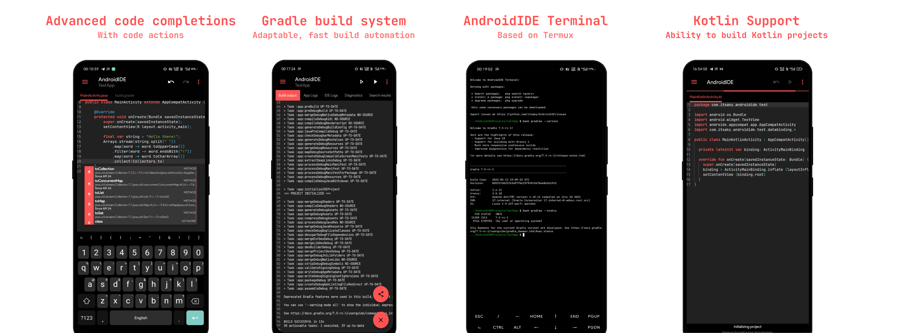

<p align="center">
  <br><br>
  <br><br>
  
</p><br>


<p align="center">

<br><br>
</p>


  

  


<br>

## Features

- [x] Gradle support.
- [x] `JDK 11` and `JDK 17` available for use.
- [x] Terminal with necessary packages.
- [x] Custom environment variables (for Build & Terminal).
- [x] SDK Manager (Available via terminal).
- [x] API information for classes and their members (since, removed, deprecated).
- [ ] Language servers
    - [x] Java
    - [x] XML (*)
    - [ ] Kotlin
- [ ] UI Designer
    - [x] Layout inflater
    - [x] Resolve resource references
    - [x] Auto-complete resource values when user edits attributes using the attribute editor
    - [x] Drag & Drop (*)
    - [x] Visual attribute editor (*)
    - [x] Android Widgets (*)
- [ ] String Translator
- [ ] Asset Studio (Drawable & Icon Maker)
- [x] Git (*)

Items marked with `(*)` are partially implemented.
`XML` language server supports only code completion at the moment. Git is currently available only
in the terminal i.e. no GUI interface for `git`.

## Installation

- Download the AndroidIDE APK from [releases](https://github.com/AndroidIDEOfficial/AndroidIDE/releases). You
  can also download APKs from [GitHub actions](https://github.com/AndroidIDEOfficial/AndroidIDE/actions).
- Follow the
  instructions [here](./docs/installation.md) to
  install the build tools.

## Limitations

- SDK Manager is already included in Android SDK and is accessible in AndroidIDE via its Terminal.
  But, you cannot use it to install some tools (like NDK) because those tools are not built for
  Android.
- No official NDK support because we haven't built the NDK for Android.

The app is still being developed actively. It's in beta stage and may not be stable. if you have any
issues using the app, please let us know.

## Contributing

See the [contributing guide](./CONTRIBUTING.md).

## Thanks to

- [Rosemoe](https://github.com/Rosemoe) for the
  awesome [CodeEditor](https://github.com/Rosemoe/sora-editor)
- [Termux](https://github.com/termux) for [Terminal Emulator](https://github.com/termux/termux-app)
- [Bogdan Melnychuk](https://github.com/bmelnychuk)
  for [AndroidTreeView](https://github.com/bmelnychuk/AndroidTreeView)
- [George Fraser](https://github.com/georgewfraser) for
  the [Java Language Server](https://github.com/georgewfraser/java-language-server)

And all the developers who have contributed to this project.

## Contact Us

- [Website](https://androidide.com)
- [Telegram](https://t.me/androidide_discussions)

## License

```
AndroidIDE is free software: you can redistribute it and/or modify
it under the terms of the GNU General Public License as published by
the Free Software Foundation, either version 3 of the License, or
(at your option) any later version.

AndroidIDE is distributed in the hope that it will be useful,
but WITHOUT ANY WARRANTY; without even the implied warranty of
MERCHANTABILITY or FITNESS FOR A PARTICULAR PURPOSE.  See the
GNU General Public License for more details.

You should have received a copy of the GNU General Public License
along with AndroidIDE.  If not, see <https://www.gnu.org/licenses/>.
```

Any violations to the license can be reported either by opening an issue or writing a mail to us directly.
