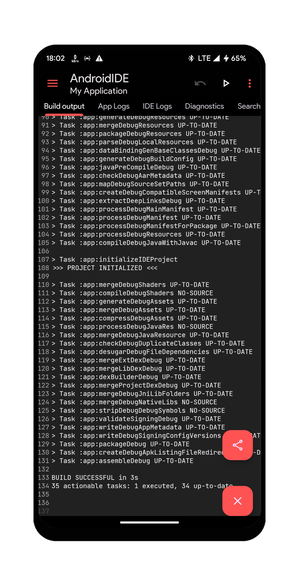
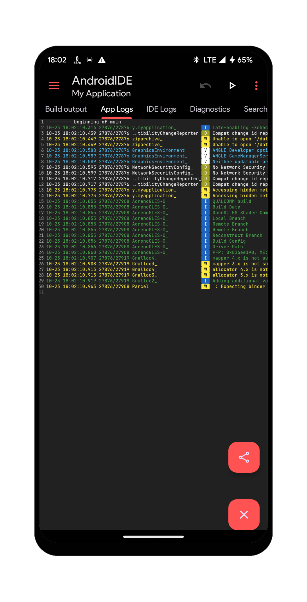
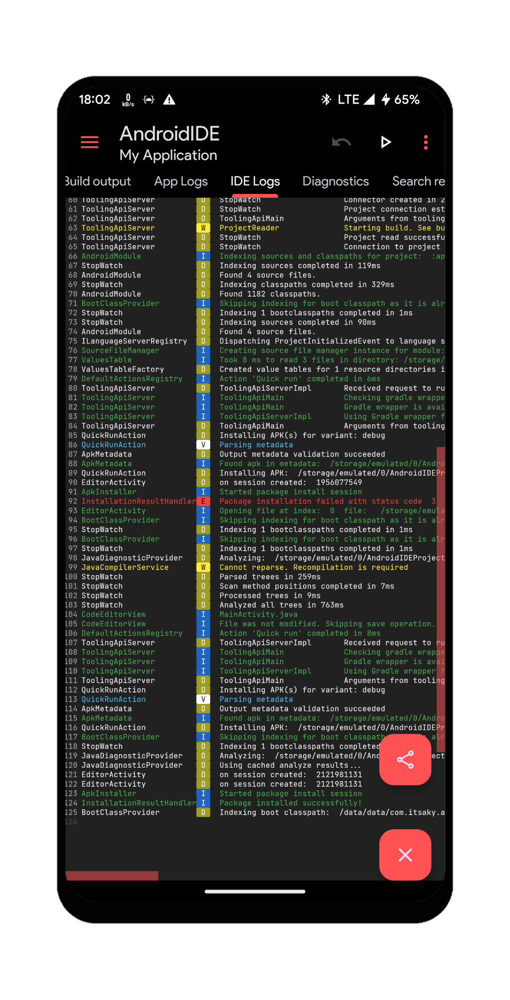
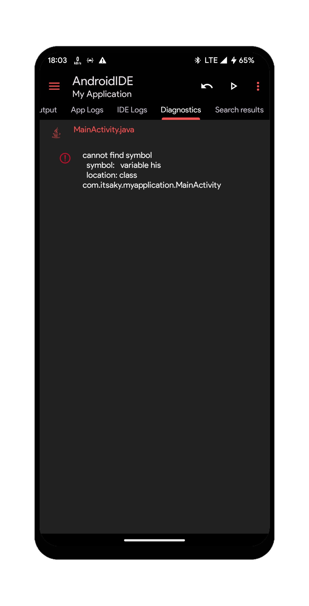
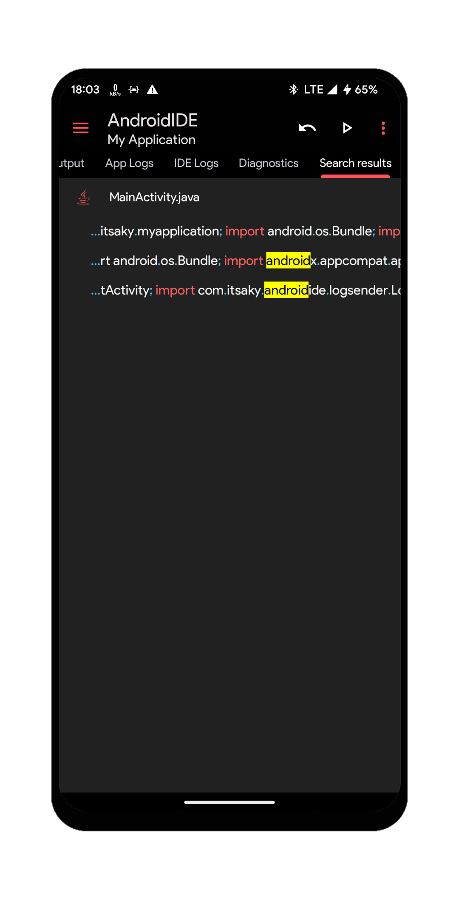

# Editor Bottom Sheet

The bottom sheet can be expanded either by sliding or by a simple click. It shows the output from various builds. It also shows the application logs, logs from the IDE itself, search results and file diagnostics.

## Build Output
This tab shows the build output as emitted by the Gradle build process. This is where your project's build related issues will be shown.

<details>
  <summary>See screenshot</summary>
  
</details>

## App Logs
This tab shows the logs received from your application.

To see logs from your application, you must invoke the `startLogging(Context)` method of `LogSender` class in your launcher activity or your application class.

In your activity or application :
```java
...
import com.itsaky.androidide.logsender.LogSender;
...
    @Override
    public void onCreate(...) {
        LogSender.startLogging(this);
        super.onCreate(...);
        ...
    }
...
```

<details>
  <summary>See screenshot</summary>
  
</details>

## IDE Logs
This tab shows the logs from the IDE. With these logs, you can understand what is going on in the IDE. If any errors occur in the IDE itself, this is where it will be shown. When reporting IDE related issues, you are expected to provide these logs.

<details>
  <summary>See screenshot</summary>
  
</details>

## Diagnostics
This tab helps you to locate and identify syntax problems with the code. See errors and warnings from your code here.

<details>
  <summary>See screenshot</summary>
  
</details>

## Search Results
The results of `Find in project` and `Find references` action are shown in this tab.

<details>
  <summary>See screenshot</summary>
  
</details>