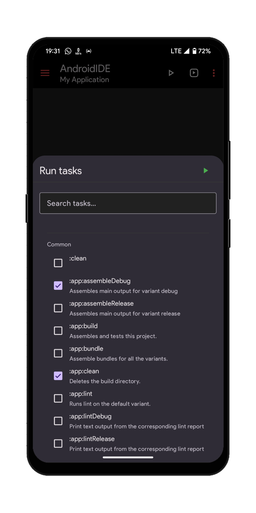
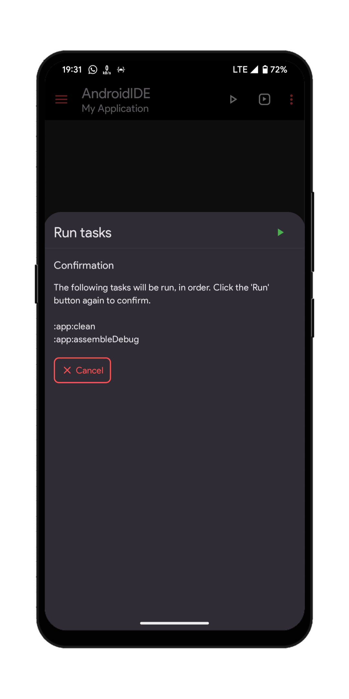

# Build Actions

The IDE provides access to various tasks which you can execute to build your project.

## The Run tasks dialog

The `Run tasks` action shows a list of all Gradle tasks that can be executed. This feature can be used only after the project is initialized.

### How to use

After the project is initialized, click the `Run tasks` action in the options menu. The dialog will show up and load the project tasks. After the tasks has been loaded, you can click the tasks to select them.

  
See screenshot

  

 

After you have selected the tasks you want to run, click on the `Run` button located at the top-right corner of the dialog. Clicking on this button will show a summary of the tasks you selected and ask you to confirm.

  
See screenshot

  

 

Click the `Run` button again to confirm. The tasks will then start to execute.