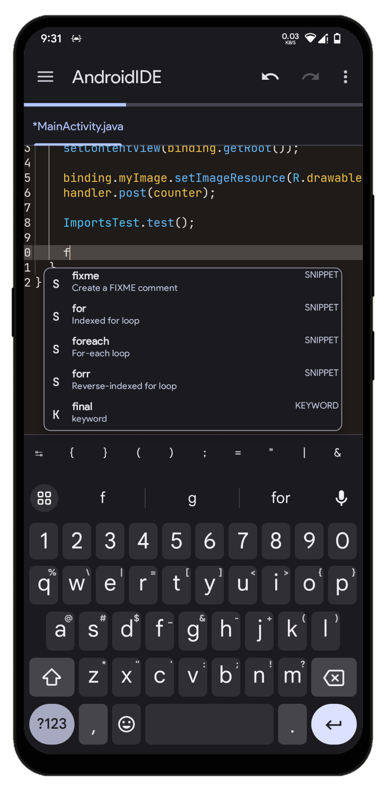

# The code editor

AndroidIDE uses [sora-editor](https://github.com/Rosemoe/sora-editor) as it's code editor. Syntax highlighting in the editor is provided with the help of lexers generated using ANTLR4.

## Key Bindings

When working with a physical keyboard, you can use use key bindings for performing various text actions.
The editor provides support for some key bindings by default.
The currently supported key bindings are mostly similar to Android Studio/Intellij IDEA.

See the [supported key bindings](./key_bindings.md).

## Text actions

When you start selecting text in the editor, a compact text actions window is shown which allows you to perform some common actions like `Select all`, `Cut`, `Copy`, `Paste`, etc. This window is always anchored to the selection handles so that it is easily accessible.

    
See screenshot

    

## Code actions

Within the [text actions window](#text-actions), there is the `Code actions` item which provides some file-specific actions that you can perform. It helps you to do some frequent tasks quickly and provides diagnostics related actions if applicable.

As of now, only [Java code actions](./java_code_actions.md) are available.

    
See location of code actions item in text actions window

    

## Color schemes

You can define your own color schemes that can be used in the editor. The color schemes are defined with JSON files. [Learn more](./color_schemes.md) about how to
define your own color schemes.

## Snippets

Code snippets are essentially pre-defined pieces of code that can be inserted into a project with a few clicks. In AndroidIDE, these snippets are presented in the code completion window, which appears as a dropdown menu when the user starts typing in the code editor. When the user selects a snippet from the list, the IDE inserts the corresponding code block into the editor at the current cursor position.

As of now, only Java Snippets are available.

    
Java snippets in code completions

    

