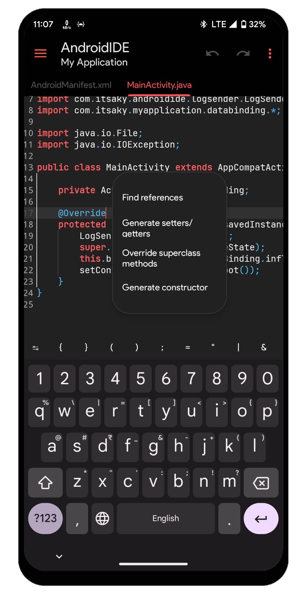

# Java code actions

  
See screenshot

  

  

## Common code actions

Common code actions which can be performed for most of the Java symbols.

| Code action           | Description                                                                                           |
| --------------------- | ----------------------------------------------------------------------------------------------------- |
| Comment line          | Comment out the selected line.                                                                        |
| Uncomment line        | Uncomment the selected line.                                                                          |
| Find references       | Finds the references to the selected variable, method, class, etc.                                    |
| Go to definition      | Finds the file and the location where the selected symbol is defined then navigates to that location. |
| Organize imports      | Organizes the imports in current file.                                                                |
| Remove unused imports | Removes all imports that are not used in the file.                                                    |

## Diagnostic related actions

Code actions that can be performed for diagnositics only.

| Code action                | Description                                                                                                                                                                                                                                        |
| -------------------------- | -------------------------------------------------------------------------------------------------------------------------------------------------------------------------------------------------------------------------------------------------- |
| Add import                 | Imports the selected, non-imported class.                                                                                                                                                                                                          |
| Add throws                 | Adds the selected throwable to the `throws` signature of the current method.                                                                                                                                                                       |
| Create missing method      | Creates the missing method. The name and signature of the method that will be created is extracted from the diagnostic.                                                                                                                            |
| Convert to block           | Moves the RHS of an unused field to the `static` block.                                                                                                                                                                                            |
| Implement abstract method  | Implements the un-implemented abstract methods that a class inherits from it's superclass/interface.                                                                                                                                               |
| Remove class               | Removes the unused class.                                                                                                                                                                                                                          |
| Remove method              | Removes the unused method.                                                                                                                                                                                                                         |
| Remove unused throws       | Removes the unused `throws` signature from a method. The unused throws warning is shown when a method defines exceptions (with the `throws` keyword) that can be thrown from the method but does not actually throw those exceptions in it's body. |
| Suppress unchecked warning | Adds the `@SuppressWarnings("unchecked")` annotation to the method.                                                                                                                                                                                |
| Convert to statement       | Converts an unused variable declaration to a statement.                                                                                                                                                                                             |

## Generators

These code actions help you add various implementations to your code.

| Code action                  | Description                                                                                                                                           |
| ---------------------------- | ----------------------------------------------------------------------------------------------------------------------------------------------------- |
| Generate constructor         | A field based action. Allows you to choose some fields from the current class and generates a constructor which accepts and initializes those fields. |
| Generate missing constructor | Generates the missing constructor implementation with the `super` constructor invocation.                                                             |
| Generate setters and getters | A field based action. Allows you to choose some fields from the current class and generates setters and getters for those fields.                     |
| Generate `toString()`        | A field based action. Allows you to choose some fields from the current class and generates the `toString()` implementation with those fields.        |
| Override superclass methods  | A method based action. Allows you to choose methods from the superclass and override them all at once.                                                |