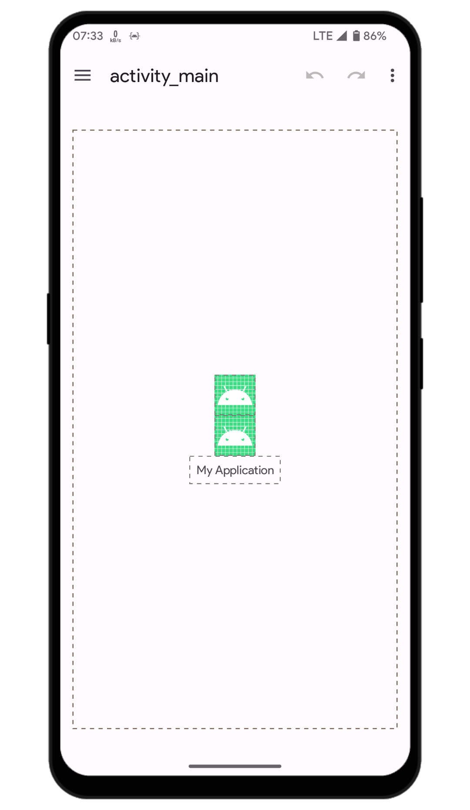
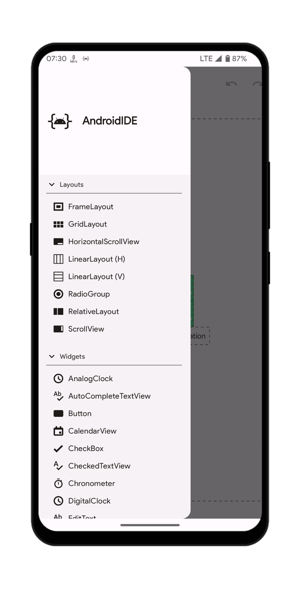
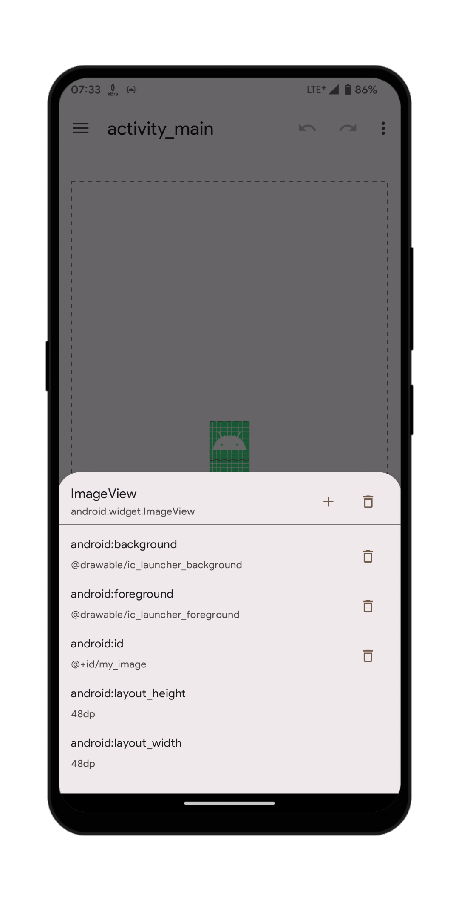
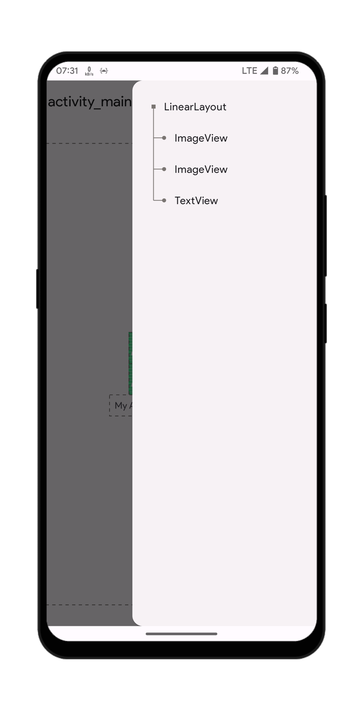

# The UI Designer

The UI Designer helps you visually design XML layouts by simply dragging and dropping widgets into the workspace.

This document briefly explains every element of the UI Designer workspace.

## The workspace

Your XML code is parsed and inflated by AndroidIDE's `LayoutInflater API` and then shown in the workspace. You can drag and drop the inflated views and widgets to move them, change their attributes, add new views or delete the existing ones.

  
Workspace

  

  
Drag-n-Drop

   
  A placeholder view is used to indicate the drop position of the widget when you start dragging.

  

### Add new views

To add new views into the workspace:
- Open the left drawer which shows a list of supported views and layouts.
- Long click on the list items to start the drag. Drop them into the workspace to add to the layout.

To move a view in the workspace, you can simply long press the view to start the drag and then drop it at the desired position.

  
Widget drawer

  

 

### Edit view attributes

Clicking on any inflated view opens the view info sheet which contains information about the view.

The sheet contains two buttons at the header :

- `Add` - Shows a list of attributes that you can add to the selected view. The list does not contain attributes that have been already applied to the view.
- `Delete` - Deletes the selected view.

It also contains the list of attributes that have been applied to the selected view.

- Clicking on any attribute opens the value editor which you can use to edit the value of the selected attribute.
- Clicking on the 'Delete' button next to the attribute deletes that attribute from the view. However, some necessary attributes cannot be deleted (`android:layout_height` and `android:layout_width` for example).

  
View info sheet

  

 

### The layout hierarchy

When views are invisible in the workspace (height or width is set to 0), it makes it harder to edit the properties/attributes of those views. This is where the layout hierachy view comes in. It shows the layout hierarchy of the views that are shown in the workspace in a tree-like structure.

You can open the layout hierarchy by simply opening the right drawer or clicking on the 'hierarchy' view in the options menu. Clicking on the nodes of the tree is same as clicking on the views in the workspace (opens up the view info sheet).

  
See screenshot

  

